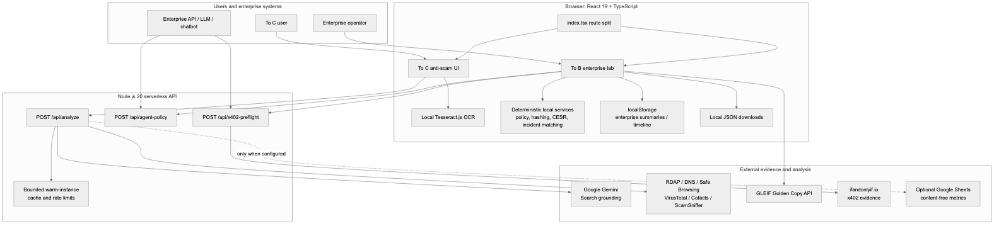
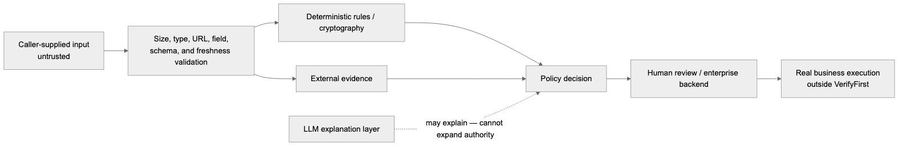
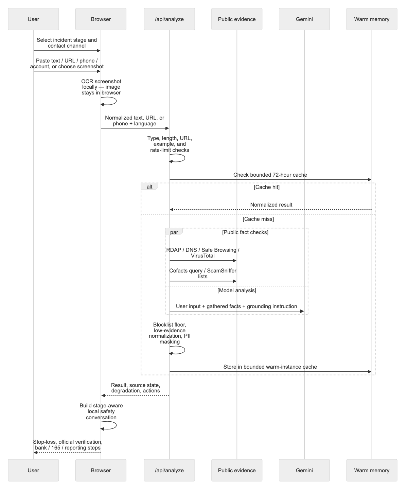
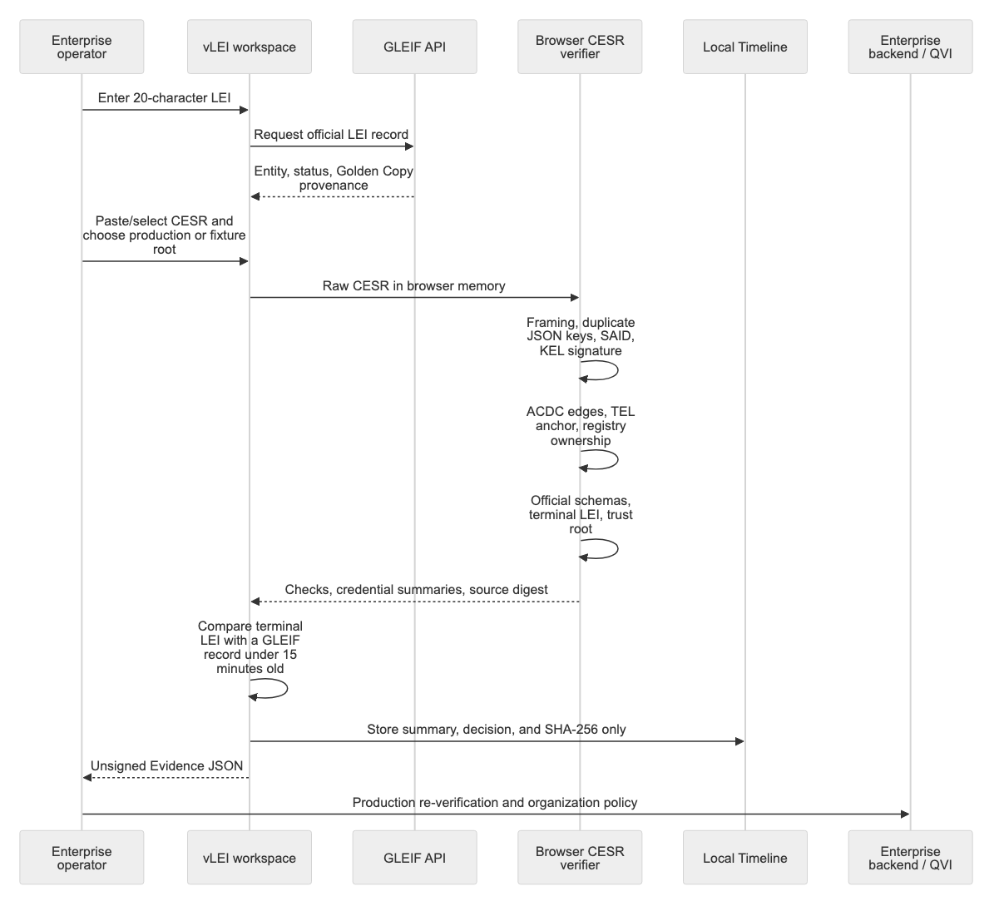
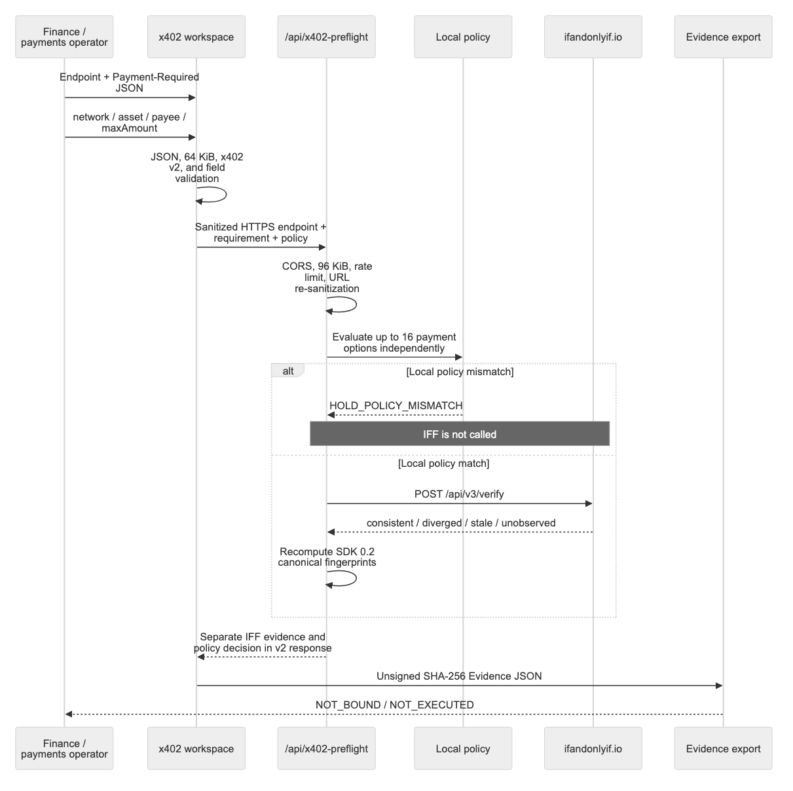
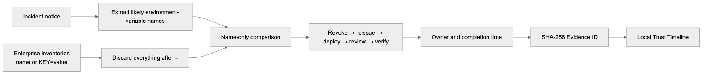
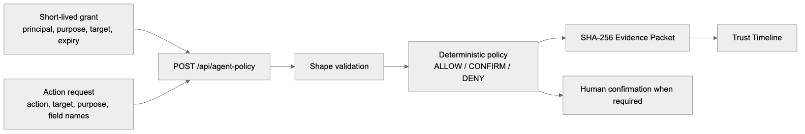

# VerifyFirst (verify1st.tw)

[繁體中文](README.md) | **English**

VerifyFirst contains two deliberately separated product surfaces:

| Surface | Audience | Stability | URL |
|---|---|---|---|
| **Personal anti-scam assistant (To C)** | People checking suspicious messages, links, calls, accounts, or screenshots | Public product | [verify1st.tw](https://verify1st.tw/) |
| **Enterprise trust lab (To B)** | Compliance, risk, security, and Agent-platform teams | **Experimental** — no SLA, not for production decisions | [verify1st.tw/business/](https://verify1st.tw/business/) |

The To C product is multilingual (Traditional Chinese, English, and Vietnamese).
It asks how far an incident has progressed, checks public evidence, and turns the
result into an on-device safety conversation for verification, loss prevention,
and reporting. Users are explicitly told not to paste passwords, OTPs, full card
numbers, ID numbers, or secret keys.

The To B lab contains the deterministic Agent policy gate, credential-incident
response, Trust Pathways scenarios, vLEI lifecycle verifier, Evidence Packets,
revocation, and IFF x402 preflight. Its two primary controls answer different
questions: vLEI checks legal-entity and representative-authority evidence;
x402 checks whether a payment requirement matches independent evidence and the
enterprise's stated payment policy. They remain separate instead of being
collapsed into one trust score. Every To B entry is marked experimental and
states its trust boundary.

See [Product Boundaries](docs/PRODUCT_BOUNDARIES.md) before extending or
deploying either surface.

VerifyFirst's original code is open source under MIT; redistributed fixtures
and upstream verifier/schema material retain their documented Apache-2.0 terms.
The enterprise verification core does not require a private LLM service:
deterministic policy, GLEIF lookup, local CESR/document hashing, simulation, and
Evidence export remain inspectable and self-hostable. See
[Self-hosting](docs/SELF_HOSTING.md) and
[Third-party notices](THIRD_PARTY_NOTICES.md).

Every pull request runs the same typecheck, test, and production-build gates
documented below. Dependency update proposals are generated from the reviewed
`package-lock.json`.

## System Architecture

### High-level component map

> Diagrams are pre-rendered as static PNG files and do not depend on GitHub's Mermaid rich display. Click any image to open it at full size.

[](docs/diagrams/en/architecture.png)

### Layer ownership

| Layer | Primary code | Responsibility | Explicit non-responsibility |
|---|---|---|---|
| Product routing | <code>index.tsx</code> | Lazy-load To C or To B from the pathname | No security decisions |
| Consumer UI | <code>App.tsx</code>, <code>components/consumer/</code> | Situation intake, OCR, results, Senior Mode, local safety conversation | Does not call threat-intelligence providers directly |
| Enterprise UI | <code>apps/business/BusinessApp.tsx</code>, <code>components/business/</code> | LEI/vLEI, x402, incident response, Agent sandbox, Timeline, Evidence export | Does not issue credentials or execute payments |
| Browser services | <code>services/</code> | Deterministic policy, CESR verification, SHA-256, data contracts, API clients | LLM output never determines enterprise verification |
| Serverless API | <code>api/</code> | Input validation, rate limiting, provider orchestration, normalization, fail-closed behavior | Does not write to Vercel Blob |
| Public schemas | <code>public/schemas/</code> | Versioned validation contracts for Evidence consumers | A schema does not prove issuer authenticity |
| Technical deep dives | <code>public/trust-pathways/</code>, <code>public/update-trust/</code> | Training scenarios and vLEI lifecycle diagnostics | Not a production verifier |

### Trust boundary

[](docs/diagrams/en/trust-boundary.png)

Caller input, external responses, CESR, x402 JSON, and historical localStorage
are all treated as untrusted. Production execution remains outside
VerifyFirst, after an accountable system repeats the necessary live checks and
applies organization policy.

### Runtime routes

| Route | Module | Runtime | Purpose |
|---|---|---|---|
| <code>/</code> | Personal anti-scam | Browser + <code>/api/analyze</code> | Multilingual intake, OCR, public evidence, recovery guidance |
| <code>/business/</code> | Enterprise overview | Browser | Guided and technical adoption entry |
| <code>/business/?module=vlei&section=lei</code> | LEI lookup | Browser → GLEIF | Official Golden Copy lookup |
| <code>/business/?module=vlei&section=vlei</code> | vLEI/CESR preflight | Browser | SAID, KEL, ACDC, TEL, schema, and root checks |
| <code>/business/?module=x402&mode=live</code> | x402 live preflight | Browser → VerifyFirst API → IFF | External consistency evidence plus enterprise policy |
| <code>/business/?module=x402&mode=simulation</code> | x402 simulation | Browser | Four labeled synthetic verdicts; no IFF call |
| <code>/business/?module=incident</code> | Credential incident response | Browser | Name-only matching, tasks, and Trust Timeline |
| <code>/business/?module=audit</code> | Agent policy control surface | Browser | Edit/revoke sandbox grants, inspect Timeline, and export audit; request evaluation is exposed by the API |
| <code>/trust-pathways/</code> | Trust Pathways | Static page + demo backend | Cross-organization scenarios and judge tour |
| <code>/update-trust/</code> | vLEI lifecycle | Static browser module | Pinned fixture, issuance proposal, selective disclosure, revocation |
| <code>/api/analyze</code> | Consumer analysis API | Serverless | Evidence gathering, Gemini, safety floors, cache |
| <code>/api/agent-policy</code> | Agent policy API | Serverless | Deterministic authorization gate |
| <code>/api/x402-preflight</code> | x402 API | Serverless | Validation, local policy, IFF evidence, v2 response |

## Information Flows

### 1. Personal anti-scam flow

[](docs/diagrams/en/consumer-flow.png)

Key details:

1. Screenshot OCR runs in the browser. The image is not uploaded by this form;
   extracted text is submitted when the user starts a check.
2. The API re-detects URL, SMS text, or phone and caps input at 2,000
   characters.
3. Built-in examples return deterministic fixtures without upstream quota.
4. Objective checks may include RDAP, DNS, Safe Browsing, VirusTotal,
   ScamSniffer, and Cofacts. Missing optional credentials produce explicit
   degradation.
5. Server-side URL observation is off by default and requires restricted
   egress when enabled.
6. Gemini receives the submitted input and gathered facts. Code then enforces
   confirmed blocklist floors and masks PII before caching and response.
7. The cache is bounded memory inside one warm serverless instance; it is not
   durable or global.
8. If AI or evidence services fail, the browser returns a clearly labeled
   local pattern screen. It does not claim that external verification
   completed.
9. Safety Assistant replies are generated locally from the result, incident
   stage, and fixed rules; its chat messages are not sent back to an LLM.

### 2. vLEI legal-entity and authority flow

[](docs/diagrams/en/vlei-flow.png)

- Raw CESR is capped at 128 KiB and remains in browser memory.
- The represented LEI comes only from the unique terminal credential.
- GLEIF state must be <code>ACTIVE</code> / <code>ISSUED</code>, and the lookup
  must be no older than 15 minutes.
- Production-root browser results still require a backend with live OOBI,
  witness, watcher, KEL/TEL/revocation retrieval, and organization root policy.
- Fixture mode uses commit-pinned GLEIF-IT regression material and is never
  evidence about a real submitting organization.

### 3. x402 payment-requirement preflight

[](docs/diagrams/en/x402-flow.png)

The endpoint is an identifier only; credentials, query, and fragment are
removed and the merchant endpoint is not fetched. A local policy mismatch
prevents the IFF request. IFF's received fingerprint must equal the local SDK
0.2 canonical result. Consistency is not merchant safety or payment
authorization. The platform never accepts keys, signs, pays, or settles.

### 4. Credential incident-response flow

[](docs/diagrams/en/incident-flow.png)

The notice body is not persisted. Secret values are discarded immediately.
Environment references retain ID, label, and system, so two systems both named
Production remain distinct. VerifyFirst produces accountable tasks but does
not connect to a cloud secret manager or revoke credentials itself.

### 5. Agent policy-gate flow

This is the standalone API's actual decision flow. The current enterprise
audit page only edits and revokes a grant, shows the Timeline, and exports an
audit bundle. The legacy <code>AgentSandbox</code> request runner is not mounted
in either product surface, so the audit page must not be presented as a
production tool-execution integration.

[](docs/diagrams/en/agent-policy-flow.png)

The client in <code>services/agentGateway.ts</code> fails closed when the server
gate is unavailable in production; only localhost development may run the same
deterministic rules locally.
<code>dataFields</code> contains names only. The sandbox grant is
caller-supplied policy, not a cryptographically verified Mandate.

## Data Classification, Transfer, and Retention

| Data | Browser | VerifyFirst API | External recipient | Retention |
|---|---|---|---|---|
| To C text / URL / phone | Form and page memory | Sent to <code>/api/analyze</code> | Gemini receives input and facts; evidence services receive the necessary fragment, URL, or hostname | Result may be cached in one warm instance for up to 72 hours |
| To C screenshot | FileReader + Tesseract OCR | Image is not sent; OCR text is sent on submit | Tesseract public assets may load from its default CDN | Image is not persisted by this flow |
| Safety Assistant chat | React state | Not sent | Not sent | Lost on reload |
| Optional labeling metrics | Content-free fields | Constructed by API | Google Sheets webhook only when configured | Controlled by deployer's Sheets policy |
| Raw CESR | React state / WebCrypto | Not sent | Not sent | Never written to localStorage |
| LEI | Input field | Does not pass through VerifyFirst API | Browser queries GLEIF directly | Summary and digest may enter localStorage |
| Local supporting documents | Read and SHA-256 hashed locally | Not sent | Not sent | Only label, category, MIME, size, digest, and time are exported |
| x402 requirement and policy | React state | Sent to preflight API in LIVE mode | Sent to IFF only after local policy matches | Full packet is downloaded; localStorage receives a summary record |
| Incident notice | React state | Not sent | Not sent | Original notice is not persisted |
| Environment inventory | Normalized locally | Not sent | Not sent | Names, environment identity, tasks, and Timeline only |
| Agent audit workspace | React state | The audit UI itself sends no request | No third party | Grant, Timeline, verification summaries, and a backward-compatible packet field in localStorage |
| Agent policy API payload | Created by an API caller | Grant, request, optional human decision | No third party | API sends <code>Cache-Control: no-store</code>; platform logs and retention remain operator responsibilities |
| Web Analytics | Optional component | Provider dependent | Loaded only when explicitly enabled | Deployer controlled |

The enterprise workspace uses <code>verifyfirst.agent-workspace.v1</code> in
localStorage. Credential response uses
<code>verifyfirst.credential-incident.v2</code>. Vercel Blob is not used at
runtime; follow the [Blob retirement checklist](docs/VERCEL_BLOB_RETIREMENT.md)
for objects left by an older deployment.

## Evidence and Execution Boundary

Browser Evidence uses sorted-JSON canonicalization and an unsigned SHA-256
self-check:

~~~text
body
  → verifyfirst.sorted-json.v1
  → SHA-256
  → id: sha256:<digest>
  → integrity.kind: SELF_CHECK_ONLY
  → integrity.authenticity: UNSIGNED
~~~

This can detect a changed body only when the expected digest is protected
separately. It does not establish issuer identity, non-repudiation, trusted
time, append-only retention, legal effect, or production authorization.
Production consumers should rerun verification in a controlled backend and
protect the result with organization signatures, trusted timestamps, or
append-only audit storage.

Current schemas:

| Schema | Purpose |
|---|---|
| <code>verifyfirst.enterprise-verification.v1</code> | LEI / vLEI enterprise packet |
| [<code>verifyfirst.vlei-handoff.v1</code>](public/schemas/verifyfirst.vlei-handoff.v1.schema.json) | Explicitly unsubmitted, unissued implementation handoff |
| [<code>verifyfirst.x402-preflight.v2</code>](public/schemas/verifyfirst.x402-preflight.v2.schema.json) | x402 Evidence for IFF SDK 0.2.0 |
| [<code>verifyfirst.x402-preflight-response.v2</code>](public/schemas/verifyfirst.x402-preflight-response.v2.schema.json) | x402 API response |
| <code>verifyfirst.agent-decision.v1</code> | Agent sandbox decision |

The x402 v1 [Evidence](public/schemas/verifyfirst.x402-preflight.v1.schema.json)
and [response](public/schemas/verifyfirst.x402-preflight-response.v1.schema.json)
remain unchanged for historical SDK 0.1.0 packets. Consumers must select a
validator by the packet's schema value and reject unknown versions.

## Features

### To C — personal anti-scam

- **Guided intake** — captures only the contact channel and whether the person
  received, opened, shared information, or already paid
- **Multi-input analysis** — SMS/text, suspicious URLs (including bare domains),
  phone numbers, accounts, screenshots with client-side OCR, and `.txt` files
- **Evidence before AI** — RDAP, Google Safe Browsing, ScamSniffer,
  VirusTotal, DNS, and Cofacts; active server-side URL observation is a
  separately enabled operator feature and is off by default
- **Safety conversation** — turns the current result and incident stage into
  immediate, multilingual recovery, verification, and reporting steps; chat
  stays in page memory and never requests credentials
- **Hard safety floors** — confirmed blocklist hits clamp the verdict in code;
  model output cannot override them
- **Senior Mode** — larger type, simpler language, and direct access to 165

### To B — enterprise trust lab (experimental)

- **Agent policy gate API** — deterministic `ALLOW`, `REQUIRE_CONFIRMATION`, or
  `DENY` through `POST /api/agent-policy`; the current audit UI manages the
  sandbox grant and Timeline but does not mount the legacy request runner
- **Revocable authorization and Evidence Packets** — purpose, target, expiry,
  action boundaries, SHA-256 evidence, and a local Trust Timeline
- **Credential incident response** — compares environment-variable names
  locally, never secret values, and builds accountable remediation tasks
- **Live legal-entity lookup** — queries the official GLEIF Golden Copy by LEI,
  with bounded responses and no synthetic fallback
- **Local vLEI / CESR verification** — accepts pasted or local CESR up to 128
  KiB and verifies SAIDs, KEL signatures, official ACDC schemas, TEL anchoring,
  registry-controller ownership, expiry, and an explicitly selected production
  or fixture trust root
- **Trust Pathways** — cross-organization scenarios at `/trust-pathways/`
- **Update Trust** — vLEI / KERI / ACDC / TEL lifecycle verification at
  `/update-trust/`
- **IFF x402 preflight** — compares an observed payment requirement with
  independent evidence; it never holds keys, signs, or pays

#### Two enterprise controls, two different decisions

| Control | Business question | Typical owner | Submission | Result |
|---|---|---|---|---|
| **vLEI legal entity and authority** | Which legal entity is represented, and does the submitted credential chain support that relationship? | Compliance, legal-entity governance, IAM, security | A 20-character LEI, a pasted or local CESR stream up to 128 KiB, and an explicit production or fixture trust root | GLEIF record provenance, cryptographic checks, terminal-LEI cross-check, decision code, limitations, and unsigned Evidence JSON |
| **x402 payment requirement** | Does the received x402 v2 requirement agree with IFF evidence and this enterprise's allowed network, asset, payee, and maximum amount? | Finance, treasury, procurement, payment engineering | A sanitized endpoint URL plus pasted or local `Payment-Required` JSON, then `network`, `asset`, `payee`, and `maxAmount` policy fields | IFF evidence and the local enterprise-policy decision shown separately, divergence details, limitations, and unsigned Evidence JSON |

Neither control executes the action it evaluates. A vLEI result does not make
VerifyFirst a QVI or allow it to issue a vLEI. An x402 `consistent` result does
not mean that a merchant is safe, that payment is authorized, or that delivery
will occur.

Both controls support two adoption depths. **Guided adoption** uses labeled
fields, official lookups, local document digests, pinned examples, and
downloadable handoff packages without requiring an internal engineering team.
**Technical integration** accepts CESR or x402 JSON, runs live checks, and
returns machine-readable Evidence that an existing API, LLM workflow, or
chatbot may consume. Secrets and raw supporting documents never belong in the
LLM path.

##### vLEI modes and production gap

- **Live-data preflight** queries the official GLEIF Golden Copy for the LEI
  and verifies the supplied CESR in the browser under the selected production
  root. Raw CESR remains in browser memory; only a bounded summary and digest
  may enter the local Trust Timeline.
- **Simulation / self-test** uses a commit-pinned upstream regression fixture
  from `GLEIF-IT/vlei-verifier` and its test trust root. The interface must
  label this result as fixture or sandbox evidence, never as a real company's
  credential, formal issuance, endorsement, or production authorization.
- **Production still requires** live OOBI resolution, witness receipts,
  watcher-based duplicity detection, current TEL / revocation retrieval, a
  backend verifier, the organization's root allow-list and policy, and an
  independently protected or signed evidence channel.
- **Issuance boundary:** VerifyFirst verifies submitted material and produces
  review evidence. It does not apply for, issue, sign, renew, or revoke a vLEI,
  and it does not claim QVI status.

##### x402 modes and production gap

- **Live preflight** accepts an endpoint identifier and x402 v2
  `Payment-Required` JSON. Before the requirement is sent through the
  VerifyFirst API to IFF, URL credentials, query parameters, and fragments are
  removed. The workspace does not fetch the merchant endpoint in this flow.
- **Simulation** produces clearly labeled synthetic IFF verdicts for training
  and policy testing. It does not contact IFF and must not be presented as an
  external observation.
- **Outputs stay separate:** IFF may report `consistent`, `diverged`, `stale`,
  or `unobserved`; VerifyFirst independently compares the requirement with the
  submitted network, asset, payee, and maximum-amount policy. The Evidence JSON
  carries an unsigned SHA-256 self-check and always records
  `execution.status: "NOT_EXECUTED"`.
- **Production still requires** enterprise authorization, budget and payee
  governance, wallet / signer isolation, settlement handling, monitoring and
  an execution adapter outside VerifyFirst. IFF unavailability or invalid
  evidence must not be converted into a passing decision.
- **Payment boundary:** VerifyFirst never accepts a private key, signs a
  transaction, moves funds, or guarantees merchant safety or delivery.

Do not submit passwords, API tokens, wallet private keys, seed phrases, OTPs,
or personal records to either workspace. Submission files should contain only
the credential or payment-requirement material needed for the selected check.

## Tech Stack

- **Frontend**: React 19, TypeScript, build-time Tailwind utilities plus
  repository-owned CSS design tokens, Vite
- **AI**: Google Gemini 2.5 Flash with Google Search grounding
- **Backend**: Vercel Serverless Functions
- **Caching**: bounded 72-hour warm-instance memory cache; no metered storage operations
- **OCR**: tesseract.js (lazy-loaded, in-browser)

## How an Analysis Works

1. Input is classified (URL / SMS text / phone) and sanitized
2. Known example chips short-circuit with canned responses (zero upstream
   quota). An exact operator-listed VerifyFirst hostname adds an identity hint
   only; it never bypasses checks or creates a safety verdict
3. Objective facts are gathered in parallel: RDAP, Safe Browsing, ScamSniffer,
   VirusTotal, DNS, and Cofacts. If the deployer explicitly enables server-side
   page observation, URLs are also fetched under a restricted-egress
   requirement. An observed x402 `402` response is preflighted through IFF
   before it is surfaced.
4. Gemini analyzes with search grounding, receiving the facts as ground truth
5. Code-level post-processing: blocklist verdict floors, low-evidence
   normalization, and PII masking
6. The result enters a bounded 72-hour warm-instance memory cache. Cold starts
   begin empty, intentionally trading shared persistence for zero metered
   storage operations

### To C data flow and retention

The To C form is an external analysis flow, not a local content-isolation
sandbox. When a user submits:

- The validated text, phone number, or URL goes to `POST /api/analyze`.
- Gemini receives that input plus the gathered evidence. Cofacts may receive up
  to the first 100 characters; enabled Safe Browsing receives the URL;
  VirusTotal, RDAP, and DNS receive the domain or hostname. ScamSniffer lists
  are downloaded by the server rather than receiving the submitted input.
- Screenshot OCR runs in the browser. The screenshot itself is not submitted
  by this form, but the extracted text is submitted when the user starts a
  check.
- The completed result, which includes the normalized input, may remain in a
  bounded warm-server memory cache for up to 72 hours. It is not written to
  Vercel Blob.
- If `GOOGLE_SHEETS_WEBHOOK_URL` is configured, the webhook receives only
  content-free metrics: submission id/time, language, input type and length,
  scores, final decision, and risk-signal types. Raw or sanitized input,
  narrative fields, and quoted evidence are excluded.
- Server-side page observation is off by default. `ENABLE_URL_OBSERVATION=true`
  allows the server to fetch the submitted URL and redirects. Enable it only
  behind restricted outbound networking; application hostname checks cannot
  fully eliminate DNS-rebinding risk.

Do not submit passwords, OTPs, full payment-card or identity numbers, wallet
seed phrases, private keys, or other secrets.

## How the Experimental Agent Filter Works

1. Resolve the Agent identity and the user it represents
2. Reject a mismatched, expired, or revoked grant before any tool runs
3. Require the request purpose and target to match the short-lived mandate
4. Compare the requested action with the grant's allow / confirm / deny lists
5. Cap personal data, login, OTP, and downloads at human confirmation; never
   sign or execute payment
6. Seal the full result into an Evidence Packet and log it in Trust Timeline

The policy gate is deterministic by design: model output can explain a risk,
but it cannot expand permissions or override a denial. The browser workspace is
functional without an external account and persists locally. Its authorization
is caller-supplied sandbox policy—not a cryptographically verified production
Mandate. A production caller must verify vLEI / signed Mandate evidence before
consuming the decision.

### Agent Policy API

`POST /api/agent-policy` accepts `{ grant, request }` and returns a deterministic
policy result, a SHA-256 Evidence Packet, and an explicit
`execution.status: "NOT_EXECUTED"` boundary. It never receives secret values;
`dataFields` contains names only.

The serialized body is capped at 32,000 characters; actions come from a fixed
allow-list and policy arrays are capped at 32 items. The endpoint currently
returns `Access-Control-Allow-Origin: *` because it is an accountless,
caller-supplied sandbox API—not a production authorization service. A public
production integration must add gateway authentication, tenant policy, exact
origin control, durable rate limiting, and audit retention. The enterprise
audit page does not call this endpoint automatically.

```bash
curl -X POST https://verify1st.tw/api/agent-policy \
  -H 'Content-Type: application/json' \
  -d '{
    "grant": {
      "id": "grant_01",
      "agentId": "agent_01",
      "agentName": "Compliance Agent",
      "agentPurpose": "Inspect supplier records",
      "userName": "Risk owner",
      "status": "ACTIVE",
      "issuedAt": "2026-08-30T00:00:00.000Z",
      "expiresAt": "2026-08-31T00:00:00.000Z",
      "allowedTargets": ["https://supplier.example"],
      "allowedActions": ["OBSERVE_URL"],
      "confirmationActions": ["SUBMIT_PERSONAL_DATA"],
      "deniedActions": ["LOGIN", "PAYMENT", "REQUEST_OTP", "DOWNLOAD_APP"]
    },
    "request": {
      "id": "req_01",
      "grantId": "grant_01",
      "action": "OBSERVE_URL",
      "target": "https://supplier.example/profile/42",
      "purpose": "Inspect supplier records",
      "dataFields": []
    }
  }'
```

### IFF x402 preflight boundary

The enterprise workspace accepts a valid x402 v2 `Payment-Required` object and
a sanitized endpoint identifier, then calls `@ifandonlyif/x402-preflight`
through the VerifyFirst API. It preserves IFF's four verdicts — `consistent`,
`diverged`, `stale`, and `unobserved` — without turning them into a hidden trust
score, and displays IFF evidence separately from the enterprise's local
network, asset, payee, and maximum-amount policy decision. Simulation mode uses
clearly labeled synthetic verdicts and does not contact IFF.

A matching requirement is evidence of consistency, not a guarantee that
payment is safe or that the endpoint will deliver afterward. Every result is
`NOT_EXECUTED`; the integration never holds a wallet key, signs, or pays.
Public checks need no API key; `IFF_BASE_URL` exists only for staging or local
IFF instances.

## Enterprise vLEI Verification Workspace

`/business/?module=vlei` is the canonical product-facing workflow. It brings
the strongest reusable parts of both demo pages into one interface:

1. Enter an LEI to query the official GLEIF record.
2. Paste or choose a CESR file; raw input remains in browser memory.
3. Select the production GLEIF root or the clearly labeled regression-fixture
   root.
4. Run the canonical verifier from `public/update-trust/said.js` locally.
5. Review the machine-readable `ALLOW_*` / `DENY_*` result, credential chain,
   failed checks, and mandatory terminal-credential LEI cross-check. Upstream
   issuer LEIs never satisfy this comparison.
6. Export an unsigned local Evidence Packet with a deterministic SHA-256
   self-check over the full decision, root, checks, credential summaries, LEI
   provenance, freshness result, and source digest. This checksum detects a
   changed body only when the expected checksum is obtained separately; it is
   not a signature, timestamp, issuer-authenticity proof, or append-only log.
   Only the bounded result summary and checksum enter the browser-local Trust
   Timeline.
7. Fill in the accountable owner, target system, and use case; optionally hash
   bounded local supporting documents and export a QVI / engineering handoff
   JSON. Only display labels, categories, MIME types, sizes, and SHA-256
   digests are exported—never document contents.

The browser verifier does not fetch live OOBI key state, verify witness
receipts, or run watcher-based duplicity detection. Its output is evidence for
review; production-root checks remain blocked from tool execution until a
backend verifier repeats those live checks. The strict enterprise wrapper also
rejects trailing/unconsumed CESR bytes, unsupported framing, issuer-to-registry
mismatches, and violations of pinned schema SAIDs plus selected fail-closed
field, edge, operator, AID, and LEI invariants. It does not claim to be a full
Draft-07 JSON Schema engine. VerifyFirst is a verifier and sandbox here, not a
QVI or vLEI issuer; fixture issuance and revocation exercises do not affect any
real KEL, TEL, credential, or legal entity.

## Enterprise x402 Preflight Workspace

The x402 workspace keeps payment evidence and payment policy as two explicit
lanes:

1. Enter an endpoint identifier, then paste or choose an x402 v2
   `Payment-Required` JSON file. The live path strips URL credentials, query,
   and fragment before sending the endpoint identifier and requirement through
   the VerifyFirst API to IFF; it does not fetch the merchant endpoint.
2. Enter the enterprise's expected `network`, `asset`, `payee`, and
   `maxAmount`. These are policy fields, not wallet credentials.
3. Choose **Live** to request IFF evidence, or **Simulation** to replay a
   visibly labeled synthetic verdict without contacting IFF.
4. Review the IFF verdict and the local policy result separately. A divergence
   identifies the mismatched condition; stale, unobserved, unavailable, or
   malformed evidence never becomes an implicit pass.
5. Export an Evidence JSON envelope containing the input digest, evidence,
   policy comparison, decision, limitations, and an unsigned SHA-256
   self-check. The result always says `NOT_EXECUTED`.

This workspace is useful for integration and policy review, but it is not a
wallet, signer, facilitator, settlement service, merchant-risk rating, or
delivery guarantee. A production deployment must connect its own authorization,
budget controls, signer isolation, monitoring, and execution layer after this
preflight; those components remain outside VerifyFirst.

## Enterprise Lab Deep Dives

Two standalone static modules under `public/` remain stable for training,
technical diagnostics, and existing demo links. Both are explicitly
experimental and must not be treated as production identity or compliance
decisions:

- **Demo video production kit** — the
  [Track 05–06 ComfyUI + MiniMax plan](docs/demo-video/track-05-06-comfyui-minimax-production-plan.md)
  prioritizes real Web screen recordings, with a 120-second storyboard,
  finalized Traditional Chinese voice-over, MiniMax prompts, a second-computer
  handoff, legal-safe labels, and explicit live／training／simulation boundaries.

- **`/trust-pathways/`** — five pain-point pathways (manufacturing, payment,
  government, migrant trust, RBA), a replayable 90-second judge tour, the GLEIF
  vLEI trust-chain explainer, live GLEIF LEI lookup, GoPlus address risk, and a
  call into the public, non-durable keripy **live demo/test backend**
  (`services/vlei-verifier`). That Vercel service is not a production verifier
  and is not part of a self-host production deployment.
- **`/update-trust/`** — the vLEI *lifecycle* page. It loads the pinned
  GLEIF-IT/vlei-verifier regression fixture (GLEIF → QVI → Legal Entity → ECR),
  recomputes every Blake3 SAID, verifies Ed25519 KEL signatures with WebCrypto,
  walks ACDC edges with the I2I rule, pins schema SAIDs to GLEIF-IT/vLEI-schema,
  then issues a *proposed* short-lived Agent Delegation ACDC chained to the real
  ECR credential, lets the supplier issue a carbon-footprint credential with
  ACDC most-compact SAIDs so a presentation can disclose only the carbon block
  (process／audit stay withheld as SAIDs yet every SAID still recomputes), and
  shows how revocation, expiry, tampering and a production root-of-trust policy
  each flip the decision to a machine-readable `DENY_*`.
  All verifier logic lives in `public/update-trust/said.js` and is unit-tested
  against the official BLAKE3 vectors and the fixture (`tests/update-trust.test.ts`).
  TEL status is only the point-in-time state established by events and exact
  KEL seals supplied in that CESR stream; it is not a live revocation query.
  Witness receipts, live key state, live TEL retrieval, and duplicity detection
  are explicitly left to the backend verifier. Unsupported event families fail
  closed instead of being ignored.

## Getting Started

### Prerequisites

- Node.js 20+
- A Google Gemini API key only when enabling live To C AI analysis

### Installation

1. Clone and install:
   ```bash
   git clone https://github.com/TokimiSpace/verifyfirst.git
   cd verifyfirst
   npm ci
   ```

2. Configure environment:
   ```bash
   cp .env.example .env.local
   ```
   Enterprise verification and local examples run without a private key. Add a
   Gemini key only to enable live To C AI analysis.

3. Start the development server:
   ```bash
   npm run dev
   ```

4. Open [http://localhost:3000](http://localhost:3000).

### Tests

```bash
npm test
```

## Environment Variables

| Variable | Required | Description |
|----------|----------|-------------|
| `GEMINI_API_KEY` | To C live only | Google Gemini API key; not used by the deterministic enterprise lab |
| `GEMINI_MODEL` | No | Analysis model override (default `gemini-2.5-flash`) |
| `GEMINI_THINKING_BUDGET` | No | Unset = model default; `0` disables thinking (cheaper/faster) |
| `MEMORY_CACHE_MAX_ENTRIES` | No | Maximum warm-instance analysis entries (default `200`, capped at `2000`) |
| `MEMORY_RATE_LIMIT_MAX_ENTRIES` | No | Maximum warm-instance hashed IP counters (default `5000`, capped at `20000`) |
| `GOOGLE_SAFE_BROWSING_KEY` | No | Enables Google Safe Browsing pre-check |
| `VIRUSTOTAL_API_KEY` | No | Enables VirusTotal pre-check |
| `GOOGLE_SHEETS_WEBHOOK_URL` | No | Sends content-free labeling metrics; never raw/sanitized input, narrative text, or quoted evidence |
| `ENABLE_URL_OBSERVATION` | No | Exact `true` opts into server-side fetches of submitted URLs; defaults off and requires restricted egress |
| `BOT_API_KEY` | No | `X-Bot-Key` header value that bypasses per-IP rate limiting |
| `COFACTS_APP_ID` | No | App id sent to the Cofacts API (default `VERIFYFIRST_AI`) |
| `IFF_BASE_URL` | No | IFF API override for staging/local testing; production defaults to `https://ifandonlyif.io` and needs no API key |
| `VITE_ENABLE_VERCEL_ANALYTICS` | No | Public build flag; analytics are off unless explicitly set to `true` |

## Deployment

The repository is platform-portable at the application layer. Vercel is the
reference serverless adapter in this repository, not a proprietary requirement
of the Evidence schemas or verification services. For runtime profiles,
required routes, and production gaps, read [Self-hosting](docs/SELF_HOSTING.md).

### Deploy to Vercel

1. Push your code to GitHub
2. Import the repository in [Vercel](https://vercel.com)
3. Add your `GEMINI_API_KEY` as an environment variable
4. Deploy

`vercel.json` raises `api/analyze.ts` to a 60s max duration — page observation
plus grounded generation can exceed the default.

### Manual Build

```bash
npm run build
npm run preview
```

## Project Structure

```
verifyfirst/
├── apps/
│   └── business/
│       └── BusinessApp.tsx   # To B enterprise lab entry (experimental)
├── api/
│   ├── analyze.ts            # Serverless endpoint: pre-checks → Gemini → post-processing
│   ├── agent-policy.ts       # Deterministic Agent gate + SHA-256 evidence
│   ├── example-responses.ts  # Canned responses for demo chips (zero quota)
│   └── safe-domains.ts       # Exact operator-listed domain identity hint; never a safety bypass
├── components/
│   ├── business/             # Integrated LEI + vLEI/CESR verification workspace
│   ├── consumer/             # To C guided intake + safety conversation
│   └── *.tsx                 # Shared and legacy feature components
├── services/
│   ├── agentPolicy.ts        # Deterministic Agent authorization gate
│   ├── agentEvidence.ts      # Agent policy Evidence Packet hashing
│   ├── evidenceIntegrity.ts  # Unsigned enterprise Evidence Packet self-check
│   ├── agentGateway.ts       # Server gate client with local static-host fallback
│   ├── credentialIncident.ts # Local-only secret-name matching + response plan
│   ├── gleif.ts              # Bounded, fail-closed official LEI lookup
│   ├── vleiClient.ts         # Production-safe wrapper around the canonical verifier
│   └── geminiService.ts      # Frontend client for /api/analyze
├── tests/                    # Vitest unit + handler integration tests
├── public/
│   ├── trust-pathways/       # Hackathon demo: five pathways + judge tour + vLEI lab
│   └── update-trust/         # vLEI lifecycle page: said.js verifier + pinned fixture
├── App.tsx                   # To C multilingual anti-scam product
├── index.tsx                 # Route-level split; lazy-loads one product
├── types.ts
└── vite.config.ts
```

## API Rate Limits

- Best-effort **10 requests per hour per hashed IP, per warm serverless
  instance** (cache hits do not count). Cold starts and parallel instances have
  independent counters, so this is not a global Gemini quota boundary.
- Results remain in a bounded warm-instance cache for up to **72 hours**
- Rate-limit counters are also warm-instance only; no request reads or writes
  metered storage
- Retiring an older Blob deployment requires the one-time
  [Vercel Blob cleanup checklist](docs/VERCEL_BLOB_RETIREMENT.md); a code deploy
  cannot delete historical public objects or revoke the old token.

## Disclaimer

This tool provides AI-generated analysis based on publicly available
information. It is a first-step aid, not a guarantee — when in doubt, call
Taiwan's 165 anti-fraud hotline. Accuracy depends on the AI model and
available web data.

## Contributing

Contributions are welcome! Please read our [Contributing Guide](CONTRIBUTING.md) for details on our code of conduct and the process for submitting pull requests.

## Security

For security vulnerabilities, please see our [Security Policy](SECURITY.md).

## License

VerifyFirst's original code, documentation, and project-created assets are
licensed under the MIT License; see [LICENSE](LICENSE). Vendored fixtures,
dependencies, schema provenance, and container inputs retain their upstream
licenses; see [Third-party notices](THIRD_PARTY_NOTICES.md) and
[`LICENSES/Apache-2.0.txt`](LICENSES/Apache-2.0.txt). The MIT copyright license
does not grant permission to present a fork as the official VerifyFirst or
TokimiSpace service; see [Trademarks](TRADEMARKS.md). For the complete commercial
use, contribution, and relicensing policy, see [Licensing strategy](LICENSING.md).

## Open-source governance

[TokimiSpace/verifyfirst](https://github.com/TokimiSpace/verifyfirst) is the
public source of truth for code, issues, pull requests, releases, and security
advisories. The former `topben/cryptotruth` repository is retained as a private
deployment/history mirror. It is not a community contribution endpoint and
must not contain committed secrets or user data. See
[Open-source governance](docs/OPEN_SOURCE_GOVERNANCE.md) for maintenance roles,
versioning, mirroring, and release rules.

## Acknowledgments

- Powered by [Google Gemini](https://ai.google.dev/) with Google Search grounding
- Community fact-checks from [Cofacts 真的假的](https://cofacts.tw)
- Blocklists from [ScamSniffer](https://scamsniffer.io) and [VirusTotal](https://virustotal.com)
- Built with [React](https://react.dev/) and [Vite](https://vitejs.dev/), deployed on [Vercel](https://vercel.com/)
