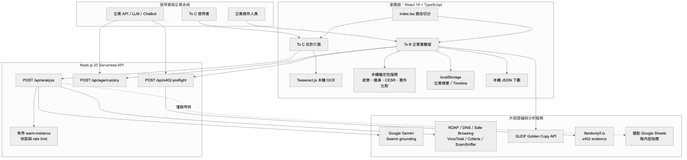
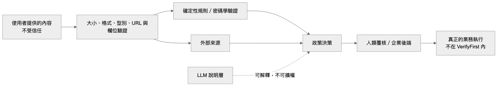
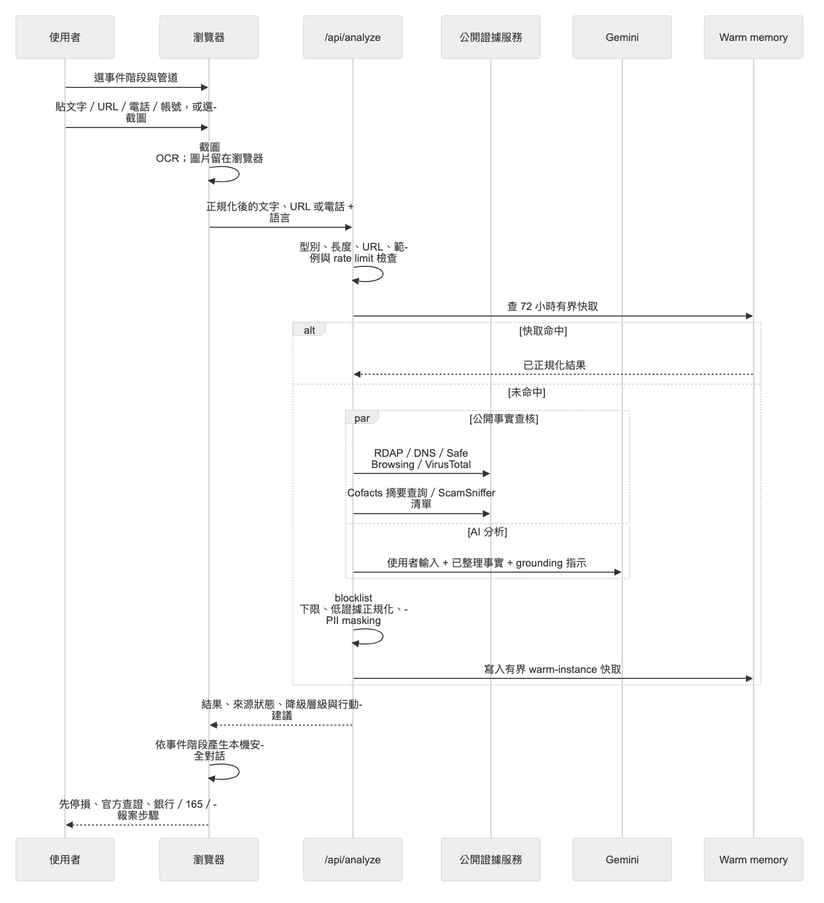
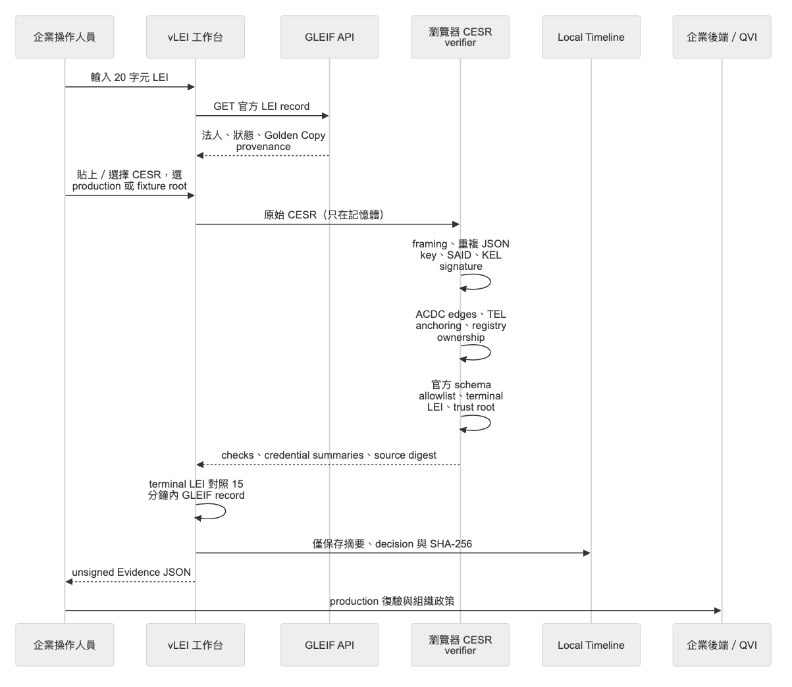
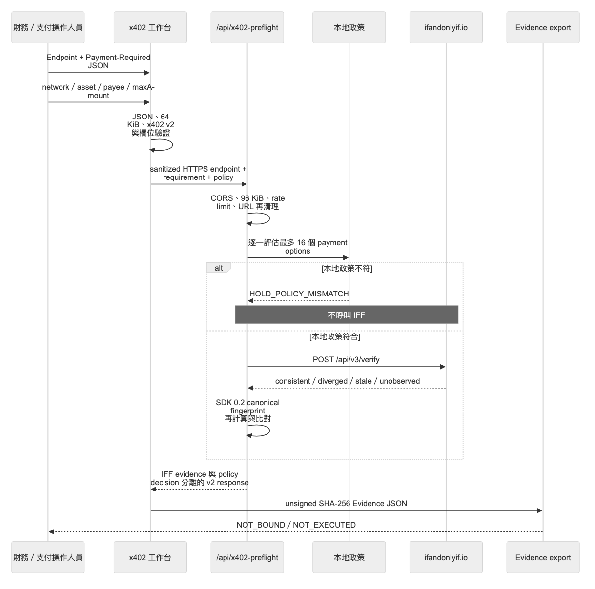
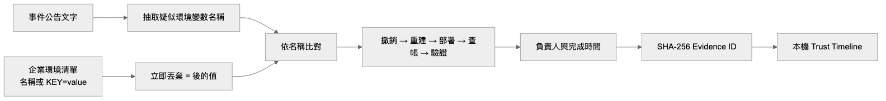
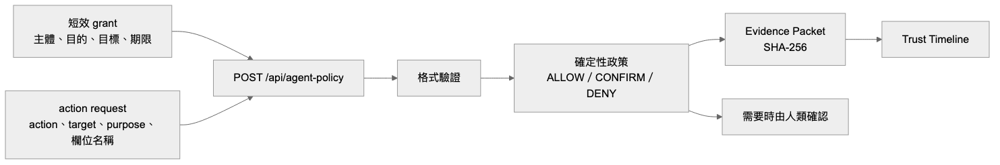

# VerifyFirst（verify1st.tw）

**繁體中文** ｜ [English](README.en.md)

VerifyFirst 是一個完全開源的「先驗證，再行動」平台。專案把兩種使用情境刻意分開：

| 產品介面 | 對象 | 解決的問題 | 穩定性 | 入口 |
|---|---|---|---|---|
| 個人反詐助手（To C） | 一般使用者、長輩、移工與第一線協助者 | 收到可疑訊息後，不知道先停損、查證還是報案 | 公開產品 | [verify1st.tw](https://verify1st.tw/) |
| 企業信任實驗室（To B） | 法遵、資安、IAM、採購、財務與 Agent 平台團隊 | 身分、授權、付款條件與事件處置缺乏可重跑的驗證證據 | **實驗性質，無 SLA** | [verify1st.tw/business/](https://verify1st.tw/business/) |

To C 支援繁體中文、英文與越南文，先詢問事件進度，再查核公開證據，最後把結果轉成止損、查證與報案步驟。To B 不用 LLM 取代驗證器，而是用確定性政策、官方 GLEIF 資料、瀏覽器端 CESR 密碼學驗證、IFF x402 證據與可下載 Evidence Packet，協助企業建立可檢查的導入路徑。

> VerifyFirst 是查核、政策預檢與交接工具，不是銀行、錢包、QVI、vLEI 發證方、支付執行器或法律意見提供者。企業實驗室的 LIVE 結果仍須接上組織自己的信任根、授權、後端復驗、稽核保存與執行系統。

## 目錄

- [產品原則](#產品原則)
- [系統架構](#系統架構)
- [路由與模組](#路由與模組)
- [資訊流](#資訊流)
- [資料分類、保存與外部傳輸](#資料分類保存與外部傳輸)
- [Evidence 與決策模型](#evidence-與決策模型)
- [API 與失敗行為](#api-與失敗行為)
- [技術棧與專案結構](#技術棧與專案結構)
- [本機開發](#本機開發)
- [環境變數](#環境變數)
- [部署與自架](#部署與自架)
- [測試、貢獻與授權](#測試貢獻與授權)

## 產品原則

1. **Evidence before AI**：客觀來源與確定性規則優先；LLM 負責整理與說明，不能推翻程式碼中的封鎖下限或擴張授權。
2. **兩個問題、兩條決策**：vLEI 回答「誰代表哪個法人、憑證鏈是否支持該關係」；x402 回答「收到的付款要求是否符合外部觀測與企業政策」。兩者不合成模糊的單一信任分數。
3. **執行與驗證分離**：所有企業結果都明確標示 <code>NOT_EXECUTED</code>；平台不登入、不索取 OTP、不持有錢包私鑰、不簽交易、不付款。
4. **秘密最小化**：憑證外洩應變只比對環境變數名稱；本機文件只輸出雜湊與中繼資料；原始 CESR 不寫入 localStorage。
5. **fail closed**：資料來源失敗、證據過期、格式錯誤、信任根不符或 IFF 無法使用時，不會自動改成通過或偷偷使用模擬結果。
6. **模擬必須可辨識**：fixture、sandbox、simulation 與 LIVE 在資料來源、畫面與輸出中都分開標示。
7. **公開格式可長期驗證**：Evidence Schema 採版本化且已發布版本不可變；新欄位或驗證器契約使用新版本。
8. **自架優先**：企業確定性核心不依賴私有 LLM API；Vercel 是參考 adapter，不是 Evidence 格式或瀏覽器驗證邏輯的必要條件。

更完整的產品邊界請閱讀 [docs/PRODUCT_BOUNDARIES.md](docs/PRODUCT_BOUNDARIES.md)。

## 系統架構

### 高階元件圖

> 圖表已預先產生為靜態 PNG，不依賴 GitHub Mermaid rich display；點擊圖片可開啟原始尺寸。

### 分層責任

| 層級 | 主要檔案 | 責任 | 不負責的事 |
|---|---|---|---|
| 路由與產品切分 | <code>index.tsx</code> | 依 pathname lazy-load To C 或 To B，避免兩個產品互相污染 | 不做安全判定 |
| To C UI | <code>App.tsx</code>、<code>components/consumer/</code> | 情境詢問、輸入、OCR、結果、長輩模式、本機安全對話 | 不直接呼叫第三方情報 API |
| To B UI | <code>apps/business/BusinessApp.tsx</code>、<code>components/business/</code> | LEI／vLEI、x402、事件應變、Agent 沙盒、Timeline 與 Evidence 下載 | 不執行付款或正式發證 |
| 瀏覽器服務 | <code>services/</code> | 確定性政策、CESR 驗證、SHA-256、自有資料格式、GLEIF／API client | LLM 不參與企業判定 |
| Serverless API | <code>api/</code> | 輸入驗證、速率限制、外部服務協調、結果正規化與 fail-closed | 不保存到 Vercel Blob |
| 公開 Schema | <code>public/schemas/</code> | 讓 Evidence consumer 驗證版本與欄位 | 不證明簽發者真實性 |
| 深度示範 | <code>public/trust-pathways/</code>、<code>public/update-trust/</code> | 情境教學、vLEI lifecycle 與技術診斷 | 不等於正式 production verifier |

### 信任邊界

所有 caller-supplied 內容、外部 API 回應、CESR、x402 JSON 與歷史 localStorage 都視為不受信任資料。系統在進入判定前進行型別、長度、來源、時效與結構檢查；production 執行仍由 VerifyFirst 外部的受控系統完成。

## 路由與模組

| 路由 | 模組 | 執行位置 | 說明 |
|---|---|---|---|
| <code>/</code> | 個人反詐助手 | 瀏覽器 + <code>/api/analyze</code> | 繁中／英／越、長輩模式、OCR、公開證據與安全步驟 |
| <code>/business/</code> | 企業實驗室總覽 | 瀏覽器 | 兩種導入深度與所有企業工具入口 |
| <code>/business/?module=vlei&section=lei</code> | LEI 查詢 | 瀏覽器 → GLEIF | 查官方 Golden Copy；查不到或不符合格式即失敗 |
| <code>/business/?module=vlei&section=vlei</code> | vLEI／CESR 預檢 | 瀏覽器 | SAID、KEL、ACDC edge、TEL、schema 與 trust root |
| <code>/business/?module=x402&mode=live</code> | x402 LIVE 預檢 | 瀏覽器 → VerifyFirst API → IFF | 外部一致性證據與本地企業政策分開呈現 |
| <code>/business/?module=x402&mode=simulation</code> | x402 模擬 | 瀏覽器 | 不呼叫 IFF，重播四種 verdict |
| <code>/business/?module=incident</code> | 憑證外洩應變 | 瀏覽器 | 只比對秘密名稱，建立處置任務與 Timeline |
| <code>/business/?module=audit</code> | Agent 政策控制面 | 瀏覽器 | 編輯／撤銷 sandbox grant、檢視 Timeline 與匯出 audit；request evaluation 由 API 提供 |
| <code>/trust-pathways/</code> | Trust Pathways | 靜態頁 + demo backend | 五條跨組織情境與黑客松導覽 |
| <code>/update-trust/</code> | vLEI lifecycle | 靜態頁／瀏覽器 | pinned fixture、SAID／KEL／TEL、撤銷與選擇性揭露 |
| <code>/api/analyze</code> | To C 分析 API | Serverless | 公開資料查核、Gemini、後處理、快取 |
| <code>/api/agent-policy</code> | Agent policy API | Serverless | 確定性授權閘門 |
| <code>/api/x402-preflight</code> | x402 API | Serverless | 輸入驗證、本地政策、IFF 觀測與 v2 response |

## 資訊流

### 1. To C 個人反詐資訊流

詳細規則：

1. 瀏覽器只把圖片 OCR 後的文字送出；這條表單不把截圖檔傳給 API。
2. <code>/api/analyze</code> 重新判斷 <code>URL</code>、<code>SMS_TEXT</code> 或 <code>PHONE</code>，限制輸入長度為 2,000 字元。
3. 內建範例直接回傳固定結果，不消耗上游額度。
4. URL 查核可使用 RDAP、DNS、Google Safe Browsing、VirusTotal 與 ScamSniffer；文字可查 Cofacts。未設定金鑰的選配來源會明確降級。
5. <code>ENABLE_URL_OBSERVATION</code> 預設關閉。啟用後才會由伺服器抓取 caller-supplied URL 與 redirect，且部署環境仍必須提供受限 egress，避免 SSRF／DNS rebinding。
6. Gemini 收到輸入與事實摘要後產生分析；程式碼再套用已確認 blocklist 的風險下限，模型不能把確認惡意的結果改成安全。
7. SMS 敘述與證據在回傳及快取前會做 PII masking。
8. 完成結果最多留在單一 warm serverless instance 的有界記憶體 72 小時；冷啟動、不同 instance 與重新部署互不共享。
9. 若 AI 或外部服務失敗，瀏覽器改用清楚標示的「本機安全初篩」。它只辨識壓迫、冒充、付款、可疑連結等文字模式，不宣稱已完成外部查證。
10. Safety Assistant 的回答由目前分析、事件階段與固定規則在瀏覽器產生，不把聊天內容再送給 LLM。

### 2. vLEI 法人與代表權資訊流

重要邊界：

- LEI 查詢只證明官方資料庫中的法人紀錄，不證明提交者持有 vLEI 或具有代表權。
- CESR 上限為 128 KiB；原始內容保持在 React state／瀏覽器記憶體，不進 localStorage、Vercel Blob 或 LLM。
- verifier 會檢查完整 framing、每段資料是否被唯一且相連的 terminal chain 消耗、官方 schema SAID、欄位與 edge 形狀、KEL 簽章、TEL seal、registry-controller ownership 與所選 trust root。
- 代表法人只能取自單一 terminal credential；上游 QVI 或 issuer 的 LEI 不可替代。
- GLEIF record 必須是 <code>ACTIVE</code>／<code>ISSUED</code> 且查詢年齡不超過 15 分鐘。
- production root 的瀏覽器結果固定要求後端復驗；仍缺 live OOBI、witness receipts、watcher duplicity、最新 KEL／TEL／revocation retrieval 與組織 root allowlist。
- fixture 使用 commit-pinned GLEIF-IT regression data，只能當測試證據。
- 最終 Evidence 是 unsigned SHA-256 self-check，不是簽章、可信時間戳或不可否認性證明。

### 3. x402 付款條件預檢資訊流

判定原則：

- Endpoint 只作為 HTTPS 識別資訊；username、password、query 與 fragment 都會移除。本流程不抓 merchant endpoint。
- <code>Payment-Required</code> 必須是 x402 v2，至少一個、最多 16 個 option；amount 必須是正整數字串。
- 企業 policy 對 network、asset、payee 與 maxAmount 分別比較。第一個完整符合的 option 只標示給人工覆核，狀態仍是 <code>NOT_BOUND</code>。
- 本地 policy 先執行；不符時不浪費 IFF 請求。
- IFF 0.2.0 的 received canonical fingerprint 必須和 VerifyFirst 本地 SDK 重算一致，否則 <code>IFF_RECEIVED_FINGERPRINT_MISMATCH</code> 並 fail closed。
- <code>consistent</code> 只表示 requirement 與目前觀測一致，不代表 merchant 安全、企業已授權付款或一定交付。
- LIVE 的 stale、unobserved、diverged、unavailable、格式錯誤與逾時都不會變成通過。
- Simulation 不接觸 IFF，輸出會標示 <code>SIMULATED</code>。
- 平台不接收私鑰、不簽名、不付款、不結算；所有輸出都是 <code>NOT_EXECUTED</code>。

IFF 的完整 HTTP 契約、大小限制與失敗碼請見 [docs/IFF_COMPATIBILITY.md](docs/IFF_COMPATIBILITY.md)。

### 4. 憑證外洩應變資訊流

- 公告原文用來抽取名稱、服務與嚴重度，但不寫入 workspace。
- 企業可分環境輸入清單；即使貼入 <code>KEY=value</code>，程式只保留大寫 KEY，value 立即丟棄。
- 同名 Production 環境以穩定 ID 與 system 欄位分開，不會合併成一筆。
- 五階段處置包含撤銷舊憑證、最小權限重建、更新部署、檢查用量／帳單／存取紀錄，以及確認舊憑證失效。
- 完成或重開任務會建立 SHA-256 Evidence ID 並寫入 local Trust Timeline。
- 此功能不直接連線雲端 secret manager，也不自動撤銷金鑰；企業仍需在原供應商完成真正的 rotate／revoke。

### 5. Agent 政策閘門資訊流

以下是獨立 API 的實際判定流程。現在的企業 audit 頁只提供 grant 政策編輯、撤銷、Timeline 與 audit 匯出；legacy <code>AgentSandbox</code> request runner 沒有掛載到產品介面，不能把 audit 頁誤認為已接上 production tool execution。

- grant 必須是 ACTIVE、未過期、未撤銷，且 agent、grant、purpose 與 target 對齊。
- LOGIN、PAYMENT、REQUEST_OTP、DOWNLOAD_APP 等高風險 action 不會被模型放行。
- <code>dataFields</code> 只接受欄位名稱，不應放資料值、密碼、OTP 或 token。
- 使用 <code>services/agentGateway.ts</code> 的 production client 在 API 無法使用時一律 <code>DENY / GATE_UNAVAILABLE</code>；只有 localhost 開發環境會使用同一套本機確定性規則。
- 瀏覽器 sandbox grant 是 caller-supplied 測試政策，不是已驗證的 production Mandate。

## 資料分類、保存與外部傳輸

| 資料 | 瀏覽器 | VerifyFirst API | 外部服務 | 保存 |
|---|---|---|---|---|
| To C 文字／URL／電話 | 表單與頁面記憶體 | 傳到 <code>/api/analyze</code> | Gemini 收到輸入與事實；其他來源收到必要的文字片段、URL 或 hostname | 結果可在單一 warm instance 快取最多 72 小時 |
| To C 截圖 | FileReader + Tesseract OCR | 圖片不送出；OCR 文字在提交後送出 | OCR 資產可能由 Tesseract 預設 CDN 載入 | 圖片不由本流程持久化 |
| To C 安全對話 | React state | 不傳送 | 不傳送 | 重新整理即消失 |
| 選配標註指標 | 無內容統計 | API 建立 | 設定 webhook 時送 Google Sheets | 由部署者的 Sheets 政策決定 |
| 原始 CESR | React state／WebCrypto | 不傳送 | 不傳送 | 不進 localStorage |
| LEI | 輸入欄位 | 不經 VerifyFirst API | 瀏覽器直接查 GLEIF API | 摘要與 digest 可進 localStorage |
| 本機 supporting documents | 瀏覽器讀檔並 SHA-256 | 不傳送 | 不傳送 | 只輸出 label、category、MIME、size、digest、時間 |
| x402 requirement 與 policy | React state | LIVE 時送 <code>/api/x402-preflight</code> | policy 符合後 requirement 與 sanitized endpoint 送 IFF | 完整 packet 下載；localStorage 只留摘要 record |
| 憑證事件公告 | React state | 不傳送 | 不傳送 | 原文不保存 |
| 環境變數清單 | 瀏覽器正規化 | 不傳送 | 不傳送 | 只保存名稱、環境、任務與 Timeline |
| Agent audit workspace | React state | audit UI 本身不送 request | 不傳送 | grant、Timeline、驗證摘要與向後相容 packet 欄位存 localStorage |
| Agent policy API payload | 由 API caller 建立 | grant、request、選配 humanDecision | 不傳送第三方 | API 設定 <code>Cache-Control: no-store</code>；部署平台 log／retention 仍由 operator 管理 |
| Web Analytics | 選配元件 | 依供應商 | 只有 <code>VITE_ENABLE_VERCEL_ANALYTICS=true</code> 才載入 | 依部署者設定 |

### localStorage keys

| Key | 內容 | 上限／生命週期 |
|---|---|---|
| <code>verifyfirst.agent-workspace.v1</code> | sandbox grant、最近 20 筆 Timeline、最多 50 筆驗證摘要，以及向後相容的 Evidence packet 陣列 | 使用者清除網站資料或在 UI 重設 |
| <code>verifyfirst.credential-incident.v2</code> | 抽取名稱、環境識別、比對、處置任務與最多 60 筆 Timeline | 使用者在 UI 清除或清除網站資料 |
| <code>verifyfirst.credential-incident.v1</code> | 舊格式，只作一次性 migration | migration 後移除 |

本專案已取消 Vercel Blob runtime 使用。舊部署若曾建立 Blob store，仍需依 [docs/VERCEL_BLOB_RETIREMENT.md](docs/VERCEL_BLOB_RETIREMENT.md) 手動清理物件與 token。

## Evidence 與決策模型

### 為什麼 Evidence 不是簽章

瀏覽器輸出的 Evidence 使用排序 JSON canonicalization 與 SHA-256：

~~~text
body
  → verifyfirst.sorted-json.v1
  → SHA-256
  → id: sha256:<digest>
  → integrity.kind: SELF_CHECK_ONLY
  → integrity.authenticity: UNSIGNED
~~~

這能在「預期 digest 由另一個可信管道保護」時偵測 body 是否改變，但任何能改 packet 的人也能重新計算 digest。因此它不提供：

- 發證者身分或 issuer authenticity
- 不可否認性
- 可信時間
- append-only log
- production authorization
- 法律效力

production 系統應將 Evidence 送到受控後端重跑驗證，再用組織金鑰簽章、可信時間戳或 append-only audit storage 保護結果。

### 目前 Schema

| Schema | 用途 |
|---|---|
| <code>verifyfirst.enterprise-verification.v1</code> | LEI／vLEI 企業驗證 packet |
| [<code>verifyfirst.vlei-handoff.v1</code>](public/schemas/verifyfirst.vlei-handoff.v1.schema.json) | QVI／工程交接草稿，固定未提交、未發證 |
| [<code>verifyfirst.x402-preflight.v2</code>](public/schemas/verifyfirst.x402-preflight.v2.schema.json) | IFF SDK 0.2.0 的 x402 Evidence |
| [<code>verifyfirst.x402-preflight-response.v2</code>](public/schemas/verifyfirst.x402-preflight-response.v2.schema.json) | x402 API response |
| <code>verifyfirst.agent-decision.v1</code> | Agent sandbox policy decision |

x402 v1 [Evidence](public/schemas/verifyfirst.x402-preflight.v1.schema.json) 與 [API response](public/schemas/verifyfirst.x402-preflight-response.v1.schema.json) 保留給 SDK 0.1.0 歷史資料。已發布 Schema 不修改；consumer 應依 packet 的 <code>schema</code> 選擇 validator，並拒絕未知版本。

### 決策與執行的分界

| 模組 | 可能結果 | 執行狀態 |
|---|---|---|
| To C | A／B／C／D 風險 lane + degradation | 提供建議，不代替使用者行動 |
| Agent gate | <code>ALLOW</code>、<code>REQUIRE_CONFIRMATION</code>、<code>DENY</code> | tool execution 在平台外 |
| vLEI | <code>ALLOW_*</code>／<code>DENY_*</code>；production browser result 仍要求 backend | 不發證、不撤銷、不執行 tool |
| x402 | READY／HOLD／DENY + IFF state | <code>NOT_BOUND</code>、<code>NOT_EXECUTED</code> |
| 憑證應變 | PENDING／COMPLETED 任務 | 不直接操作供應商 secret |

## API 與失敗行為

### <code>POST /api/analyze</code>

輸入概念：

~~~json
{
  "input": "https://example.com",
  "inputType": "URL",
  "language": "zh-TW",
  "forceRefresh": false
}
~~~

- 最多 2,000 字元；支援 <code>URL</code>、<code>SMS_TEXT</code>、<code>PHONE</code>。
- 每個 hashed IP、每個 warm instance 每小時最佳努力 10 次；cache hit 不計。
- <code>X-Bot-Key</code> 可供可信 server-to-server caller 繞過此本機限制，但不可放進瀏覽器。
- 外部來源失敗會回傳 degradation；Gemini／整體失敗時前端使用本機初篩。
- 這不是全域 quota。真正的濫用控制需由 gateway、Durable store 或供應商 budget 完成。

### <code>POST /api/agent-policy</code>

輸入為 <code>{ grant, request, humanDecision? }</code>，輸出確定性 result、Evidence Packet 與 <code>NOT_EXECUTED</code> 邊界。錯誤格式回 400，非 POST 回 405。

- JSON 序列化後上限 32,000 字元；action 必須來自固定 allowlist，陣列最多 32 項。
- 目前 endpoint 回傳 <code>Access-Control-Allow-Origin: *</code>，因為它是無帳號、caller-supplied grant 的實驗 API，不是 production authorization service。公開部署前應由 gateway 收斂 origin、authentication、tenant policy、durable rate limit 與 audit retention。
- 企業 audit UI 不會自動呼叫這個 endpoint；需要由整合方或未來明確掛載的 request runner 呼叫。

### <code>POST /api/x402-preflight</code>

輸入概念：

~~~json
{
  "endpointUrl": "https://merchant.example/paid-resource",
  "paymentRequired": {
    "x402Version": 2,
    "accepts": [
      {
        "scheme": "exact",
        "network": "eip155:8453",
        "asset": "0x0000000000000000000000000000000000000000",
        "amount": "1000",
        "payTo": "0x1111111111111111111111111111111111111111"
      }
    ]
  },
  "policy": {
    "allowedNetworks": ["eip155:8453"],
    "allowedAssets": ["0x0000000000000000000000000000000000000000"],
    "allowedPayees": ["0x1111111111111111111111111111111111111111"],
    "maxAmount": "1000"
  }
}
~~~

- Request body 上限 96 KiB。
- 每個 hashed IP、每個 warm instance 每分鐘最佳努力 30 次；map 最多 5,000 筆。
- same-origin 預設；<code>X402_ALLOWED_ORIGIN</code> 只接受一個精確 HTTPS origin，不支援 wildcard。
- <code>BOT_API_KEY</code> 使用 SHA-256 digest 與 constant-time bytes comparison。
- IFF 預設 timeout 5 秒、response 上限 256 KiB；HTTP、逾時、格式與 fingerprint mismatch 都保持 unavailable／hold。
- API response 使用 <code>verifyfirst.x402-preflight-response.v2</code>。

## 技術棧與專案結構

### 技術棧

- Frontend：React 19、TypeScript、Vite 6、Tailwind 3 utilities、repository-owned CSS tokens
- Server：Node.js 20 相容的 Vercel Serverless Functions
- AI：Google Gemini 2.5 Flash + Google Search grounding（只用於 To C LIVE）
- OCR：Tesseract.js 7，lazy-loaded、瀏覽器執行
- vLEI：WebCrypto Ed25519、BLAKE3／SAID、KERI／ACDC／TEL 邏輯
- x402：<code>@ifandonlyif/x402-preflight@0.2.0</code>
- Test：Vitest、TypeScript typecheck、Vite production build
- Storage：瀏覽器 localStorage + 有界 warm-instance memory；無 Vercel Blob runtime dependency
- License：原始程式 MIT；上游 fixture／schema／verifier 材料依 THIRD_PARTY_NOTICES 保留 Apache-2.0 等原授權

### 專案結構

~~~text
cryptotruth/
├── apps/
│   └── business/
│       └── BusinessApp.tsx          # To B 入口、模組路由與本機 workspace
├── api/
│   ├── analyze.ts                   # To C 證據協調、Gemini、後處理、快取
│   ├── agent-policy.ts              # 確定性 Agent gate
│   ├── x402-preflight.ts            # x402 policy + IFF API
│   ├── example-responses.ts         # 零上游額度的固定範例
│   └── safe-domains.ts              # 精確 hostname 身分提示；不是安全 bypass
├── components/
│   ├── consumer/                    # 情境輸入與本機 Safety Assistant
│   ├── business/                    # LEI／vLEI 與 x402 工作台
│   ├── CredentialIncidentResponse.tsx
│   ├── SandboxControl.tsx
│   └── 其他 To C 結果與共用 UI
├── services/
│   ├── geminiService.ts             # 瀏覽器 → /api/analyze
│   ├── localSafetyFallback.ts       # 外部服務失敗時的本機規則
│   ├── agentPolicy.ts               # Agent 確定性規則
│   ├── agentEvidence.ts             # Agent Evidence SHA-256
│   ├── agentGateway.ts              # production fail-closed gateway client
│   ├── credentialIncident.ts        # 秘密名稱抽取、比對與處置計畫
│   ├── evidenceIntegrity.ts         # Evidence canonicalization／self-check
│   ├── gleif.ts                     # bounded official LEI lookup
│   ├── vleiClient.ts                # strict browser CESR wrapper
│   ├── vleiHandoff.ts               # QVI／工程交接格式
│   ├── localDocumentManifest.ts     # 本機文件雜湊
│   ├── iffX402.ts                   # IFF transport 與 canonical fingerprint
│   └── x402Policy.ts                # x402 v2 parsing 與企業政策
├── public/
│   ├── schemas/                     # 公開、版本化 JSON Schema
│   ├── trust-pathways/              # 情境示範與技術導覽
│   ├── update-trust/                # vLEI lifecycle verifier
│   └── privacy/                     # 公開資料處理說明
├── services/vlei-verifier/          # 非 durable 的 demo/test backend
├── docs/                            # 邊界、自架、IFF 契約、Blob 退場與影片計畫
├── tests/                           # 單元、handler integration、schema boundary
├── App.tsx                          # To C 主程式
├── index.tsx                        # route-level lazy split
├── types.ts                         # 共用資料契約
├── styles.css
├── vercel.json
└── vite.config.ts
~~~

## 本機開發

### 前置需求

- Node.js 20+
- npm 10.9.3（以 <code>packageManager</code> 為準）
- 只有啟用 To C LIVE AI 時需要 Gemini API key
- 企業本機驗證、LEI 公開查詢、x402 simulation 與固定 fixture 不需要私有 LLM key

### 安裝

~~~bash
git clone https://github.com/topben/cryptotruth.git
cd cryptotruth
npm ci
cp .env.example .env.local
npm run dev
~~~

開啟：

- To C：[http://localhost:3000/](http://localhost:3000/)
- To B：[http://localhost:3000/business/](http://localhost:3000/business/)
- Trust Pathways：[http://localhost:3000/trust-pathways/](http://localhost:3000/trust-pathways/)
- Update Trust：[http://localhost:3000/update-trust/](http://localhost:3000/update-trust/)

純 Vite dev server 不會自動提供 Vercel Functions。To C LIVE、x402 LIVE 與 server Agent API 需要 Vercel dev 或其他 Node adapter；靜態／本機流程必須在缺少 LIVE API 時明確顯示失敗或降級，不可偽裝成 LIVE 成功。

### 驗證

~~~bash
npm run typecheck
npm test
npm run build
npm audit --omit=dev
~~~

目前測試涵蓋：

- Agent policy 與 Evidence integrity
- To C handler、快取、降級與安全下限
- GLEIF bounded lookup
- vLEI framing、schema、KEL、ACDC、TEL、root 與 LEI cross-check
- local document manifest
- credential incident response
- x402 parser、policy、IFF compatibility、API、rate limit 與 CORS
- Trust Pathways／Update Trust 靜態邊界
- open-source readiness 與產品隔離

## 環境變數

| 變數 | 必要性 | 用途與邊界 |
|---|---|---|
| <code>GEMINI_API_KEY</code> | To C LIVE 必要 | 只在 server 使用，不可加 <code>VITE_</code> |
| <code>GEMINI_MODEL</code> | 選配 | 預設 <code>gemini-2.5-flash</code> |
| <code>GEMINI_THINKING_BUDGET</code> | 選配 | 未設定使用模型預設；<code>0</code> 關閉 thinking |
| <code>GOOGLE_SAFE_BROWSING_KEY</code> | 選配 | 啟用 URL threat pre-check |
| <code>VIRUSTOTAL_API_KEY</code> | 選配 | 啟用 domain reputation |
| <code>COFACTS_APP_ID</code> | 選配 | 預設 <code>VERIFYFIRST_AI</code> |
| <code>GOOGLE_SHEETS_WEBHOOK_URL</code> | 選配 | 只送無內容標註指標；部署前須揭露 |
| <code>ENABLE_URL_OBSERVATION</code> | 選配 | 只有精確 <code>true</code> 啟用 server URL fetch；需要受限 egress |
| <code>BOT_API_KEY</code> | 選配 | server-to-server rate-limit bypass；不可進瀏覽器 |
| <code>IFF_BASE_URL</code> | 選配 | 預設 <code>https://ifandonlyif.io</code>；只允許 HTTPS 或 loopback HTTP |
| <code>X402_ALLOWED_ORIGIN</code> | 選配 | 一個精確 HTTPS cross-origin caller |
| <code>VITE_ENABLE_VERCEL_ANALYTICS</code> | 選配 | 預設 false；true 才載入 analytics |
| <code>VITE_TESSERACT_WORKER_PATH</code> | 選配 | 自架 OCR worker 公開 URL |
| <code>VITE_TESSERACT_CORE_PATH</code> | 選配 | 自架 OCR core 公開 URL |
| <code>VITE_TESSERACT_LANG_PATH</code> | 選配 | 自架 OCR language data URL |
| <code>MEMORY_CACHE_MAX_ENTRIES</code> | 選配 | 預設 200、最小 10、上限 2,000 |
| <code>MEMORY_RATE_LIMIT_MAX_ENTRIES</code> | 選配 | 預設 5,000、最小 100、上限 20,000 |

請以 [.env.example](.env.example) 為實際設定起點。所有 secret 只能留在 server；不要 commit <code>.env</code>、token、私有 fixture 或使用者提交資料。

## 部署與自架

### Vercel 參考部署

1. Fork 或 clone repository。
2. 在 Vercel 匯入專案。
3. 若需要 To C LIVE，設定 <code>GEMINI_API_KEY</code> 與選配證據來源。
4. 部署。<code>vercel.json</code> 會將 <code>/business</code> rewrite 到 SPA，並把 <code>api/analyze.ts</code> max duration 設為 60 秒。
5. 依實際啟用來源發布 privacy notice、retention policy 與 provider list。
6. 為 Gemini、VirusTotal、Safe Browsing 與外部 API 設定 provider-side quota／alert；warm-instance rate limit 不是全域防護。

### 其他平台

部署 <code>npm run build</code> 產生的 <code>dist/</code>，並提供 Node.js 20 相容 adapter 對應三個 API。SPA host 至少要將 <code>/business</code> 與 <code>/business/</code> rewrite 到 <code>index.html</code>。

完全靜態部署仍可使用：

- To C 固定範例與本機安全初篩
- x402 simulation
- 本機文件 manifest
- pinned vLEI fixture 與瀏覽器驗證
- Trust Pathways／Update Trust 靜態內容

LIVE route 缺少 server adapter 時必須回報不可用，不能靜默切成模擬結果。完整說明請見 [docs/SELF_HOSTING.md](docs/SELF_HOSTING.md) 與 [SECURITY.md](SECURITY.md)。

## 測試、貢獻與授權

### Pull request 檢查

1. 標示影響 To C、To B 或 shared infrastructure。
2. 說明資料是否跨越 browser／server／external boundary。
3. 為安全下限、格式錯誤、上游失敗與 migration 補測試。
4. 修改共用 routing、CSS 或部署設定時，驗證 <code>/</code>、<code>/business/</code>、<code>/trust-pathways/</code>、<code>/update-trust/</code>。
5. 不得移除 experimental／simulation／unsigned／NOT_EXECUTED 標示，除非有相應 production evidence 與 maintainer review。
6. 公開 Schema 不可原地修改；新增版本並保留歷史 validator。

歡迎貢獻，請閱讀 [CONTRIBUTING.md](CONTRIBUTING.md)、[CODE_OF_CONDUCT.md](CODE_OF_CONDUCT.md) 與 [SECURITY.md](SECURITY.md)。

VerifyFirst 原始程式碼採 [MIT License](LICENSE)。重新散布的 fixture、schema provenance 與 verifier material 保留各自授權，詳見 [THIRD_PARTY_NOTICES.md](THIRD_PARTY_NOTICES.md) 與 [LICENSES/Apache-2.0.txt](LICENSES/Apache-2.0.txt)。

## 致謝

- [Google Gemini](https://ai.google.dev/) 與 Google Search grounding
- [Cofacts 真的假的](https://cofacts.tw)
- [ScamSniffer](https://scamsniffer.io/)、[VirusTotal](https://virustotal.com/) 與 Google Safe Browsing
- [GLEIF](https://www.gleif.org/) 與 GLEIF-IT vLEI open-source materials
- [ifandonlyif.io](https://ifandonlyif.io/) 與 x402 ecosystem
- [React](https://react.dev/)、[Vite](https://vite.dev/) 與所有開源依賴
